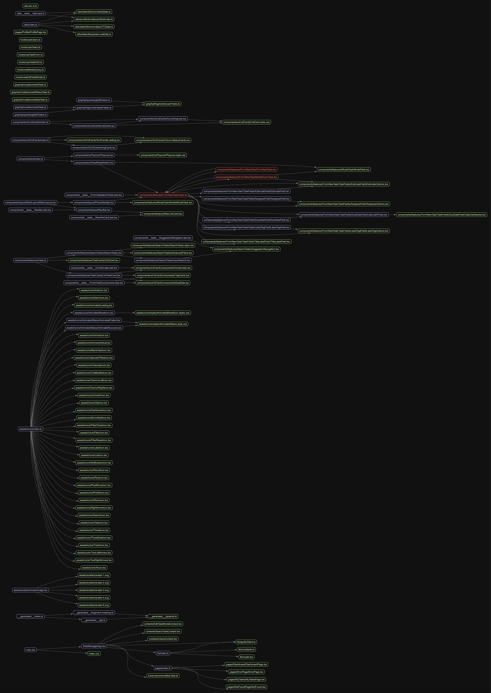
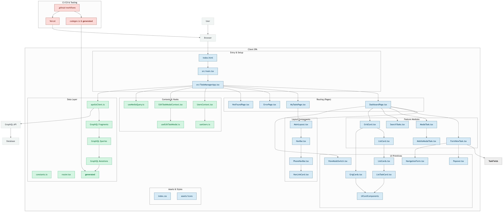

# Task Manager App

React, TypeScript, and GraphQL Ravn's final challenge.

## 📋 Project Description

This application is a task management dashboard that allows users to organize, track, and manage tasks across different status columns (Backlog, Todo, In Progress, Done, Cancelled). Built with modern React patterns and GraphQL for efficient data management.

## 🚀 Setup/Running Instructions

### Prerequisites

- Node.js 22+
- npm or yarn

### Installation & Development

```bash
# Clone the repository
git clone https://github.com/jimhuertas123/task-manager-challenge-app
cd task-manager-app

# Install dependencies
yarn

# Start development server
yarn dev
```

### Available Scripts

```bash
npm run dev          # Start development server
npm run build        # Build for production
npm run preview      # Preview production build
npm run lint         # Run ESLint
npm run lint:fix     # Fix ESLint issues
npm run format       # Format code with Prettier
npm run type-check   # TypeScript type checking
npm run codegen      # Generate GraphQL types
```

## 🛠 Technologies/Libraries Used

### Core Stack

- **React 19**
- **TypeScript**
- **Vite**
- **React Router DOM**

### GraphQL & State Management

- **Apollo Client**
- **GraphQL Code Generator**

### Development Tools

- **ESLint**
- **Prettier**
- **Husky**
- **lint-staged**
- **react-error-boundary**

### CI/CD

- **GitHub Actions**
- **Vercel**

## 🏗 Project Structure & Architecture

**Feature-Driven Development (FDD)**

```
src/
├── components/
│   ├── ui/
│   │   ├── ListCards/
│   │   ├── GridCards/
│   │   ├── Popover/
│   │   └── UICardComponents/
│   ├── layout/
|   |   └── MainLayout/
│   └── features/
│       ├── FormNewTask/
│       │   ├── FormNewTask.tsx
│       │   ├── MobileFormTask.tsx
│       ├── ModalTask/
│       └── TaskCards/
│           └── GridCard.tsx
├── pages/
│   ├── Dashboard/
│   │   └── DashboardPage.tsx
│   ├── MyTasks/
│   │   └── MyTasksPage.tsx
├── hooks/
│   ├── useTaskForm.ts
│   ├── useUsers.ts
│   ├── useTasks.ts
│   └── useEditTaskModal.ts
├── graphql/
├── utils/
│   ├── pointEstimate.ts
│   ├── dateUtils.ts
│   └── index.ts
├── assets/
│   ├── avatars/
│   │   └── AvatarImage.tsx
│   └── icons/
│       ├── BlankTaskIcon.tsx
│       └── index.ts
└── schema/
    └── schemaNewTask.ts
```

## ✅ Current Status

The project is nearly complete and includes:

- Full dashboard layout with sidebar navigation
- Task board with status columns and drag & drop support
- Task cards displaying all required information
- Routing with NotFound and Error pages
- GraphQL integration for CRUD operations
- Search and filtering functionality
- User settings/profile page
- Responsive design for mobile and desktop
- Animations and interactive UI elements
- Robust error handling and loading states
- Modern development tooling and CI/CD pipeline

## 🎯 Features Roadmap

All core features have been implemented. Any remaining improvements will focus on polish, performance, and additional enhancements as needed.

## 📊 Software Visualization

### Git History using Gource


### Madge: Dependencie Graph



### Project Structure



## 🎯 Features Roadmap

### Week 1: Foundation & Core UI

- [x] Dashboard layout with sidebar navigation
- [x] Task board with status columns
- [x] Task cards with all required information
- [x] Basic routing setup with NotFound and Error pages
- [x] Feature-Driven Architecture

### Week 2: Functionality & Advanced Features

- [x] GraphQL integration for CRUD operations
- [x] Search and filtering functionality
- [x] User settings page
- [x] Bonus features (drag & drop, animations, etc.)
